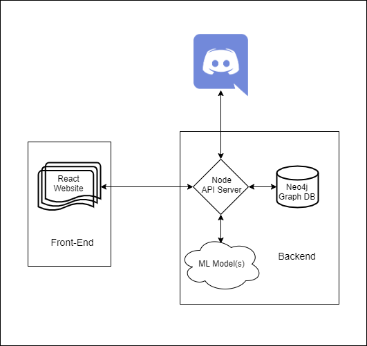

# Don't let your memes be dreams

**janule** is a [Discord](https://discord.com/) bot which helps with meme storage.

## TL;DR

1. `npm install` to install dependencies
2. Put secrets for connecting to services in `secrets.json`
3. Run `npm run-scripts all` (do this before committing to make sure everything works)

## Installing dependencies

`npm install <package name>`

For "dev" dependencies (like `prettier`), use `--save-dev`.

FYI We're using Node v13.3.0

## `prettier` file formatting

`npm run-script prettify`

This will clean up everything in `src/`.

See:
 * https://prettier.io/docs/en/options.html
 * https://prettier.io/docs/en/configuration.html

## Architecture

## Run!

`npm run-script start`
